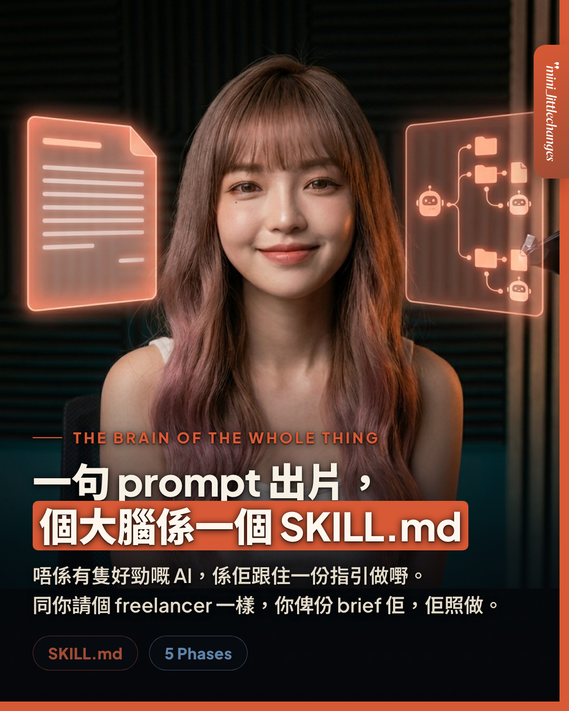

<div align="center">
  
</div>

# Mini Socials Skills

> AI agent skills by [Mini Socials](https://www.threads.net/@mini_littlechanges) — content, video, and workflow skills for creators and small brands.

## Install

```bash
# install everything
npx skills add minilittlechanges-ai/skills

# or a single skill
npx skills add minilittlechanges-ai/skills --skill launch-video
```

## Skills

| Skill | What it does | Fill first |
|-------|--------------|------------|
| [launch-video](skills/launch-video/SKILL.md) | Turn a one-line prompt into a finished, on-brand launch video through a phased agent workflow (brand-frame → storyboard → audio → visuals → render → ship). | `frame.md` (your colours, type, motion, voice) |

Click a skill name for the full workflow.

---

### About `launch-video`

一句 prompt 出片，唔係因為隻 AI 好勁，係因為佢有份 **`SKILL.md`** 跟住做。

It's a **skeleton**, not a finished config. Fill every `⟨…⟩` with your own brand and you have your own launch-video agent. Three things don't travel with the file, and they're your real value: your **brand frame (taste)**, **directing each phase**, and the **feedback loop** after posting.

---

Want a skill set up, deployed, and maintained *for* your brand instead of building it yourself? DM **[@mini_littlechanges](https://www.threads.net/@mini_littlechanges)**.

*Made by Mini Socials · 你的 AI 社群拍檔 · MIT*
